# MultiBackendTeam3

## 프로젝트 목적
>### 국내 여행을 계획하고 있는 관광객들을 위한 일정 관리 도구 제공

<br>

# 사용 기술
## BackEnd
- JDK 11
- Spring Boot v2.7.12
- Spring Security
- Spring Validation
- MyBatis
- Json-simple

## FrontEnd
- JSP
- JSTL
- CSS
- JavaScript
- AJAX
- jQuery
- BootStrap 5


## API
- 카카오 지도 Web API
- 한국관광공사 Tour API
- 기상청 단기예보 API

## Server
- AWS EC2
- Ubuntu 22.04

## 참고
- https://gist.github.com/fronteer-kr/14d7f779d52a21ac2f16#file-

<br>

# 수행 도구
## 개발도구
- InteliJ IDEA
- VS Code
- SQL Developer 혹은 DBeaver

## 빌드도구
- Gradle

## 형상관리
- GitHub
- Git
- SourceTree

## 테스트도구
- JUnit
- Postman

<br>

# 프로젝트 사이트 기능

## 1. 메인 페이지
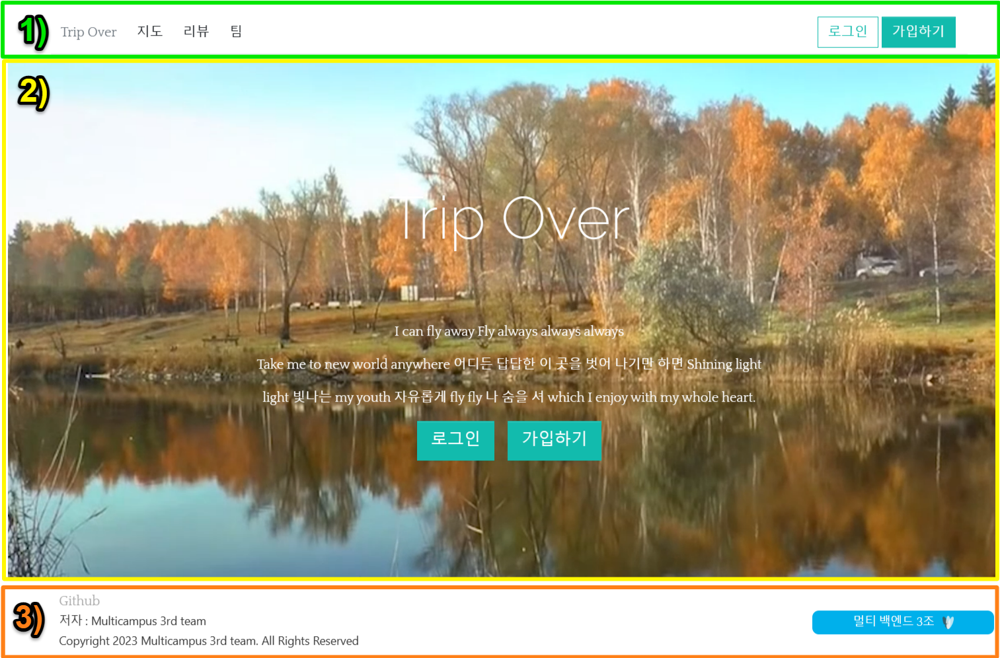

### 1-1. 헤더 (1. 메인페이지 그림 1번)


- 1-1. 헤더 그림 1번은 각 메인 페이지, [지도 페이지](#2-지도-페이지), [리뷰 페이지](#3-리뷰-페이지), [팀 페이지](#4-팀-페이지)로 이동하는 링크를 나타낸다.
- 1-1. 헤더 그림 2번과 같이 [로그인 페이지](#5-로그인-페이지) 및 [가입 페이지](#6-가입-페이지)로 이동하는 링크를 나타낸다.
- 1-1. 헤더 그림 3번은 로그인 여부에 따라 [마이 페이지](#7-마이-페이지) 및 로그아웃 버튼을 나타냄을 보여준다.
- 1-1. 헤더 그림 4번은 어드민 계정 로그인에 따라 [관리자 페이지](#8-관리자-페이지)로 이동하는 버튼을 추가적으로 나타냄을 보여준다.

### 1-2. 바디 (1. 메인페이지 그림 2번)


- 메인 페이지는 영상을 반복 재생된다.
- 1-2. 바디 그림 1번과 같이 [로그인 페이지](#5-로그인-페이지) 및 [가입 페이지](#6-가입-페이지)로 이동하는 링크를 나타낸다.
- 1-2. 바디 그림 2번은 로그인 여부에 따라 로그아웃 버튼이 나타냄을 보여준다.

### 1-3. 푸터 (1. 메인페이지 그림 3번)
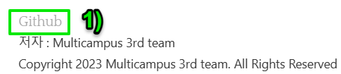
- 1-3. 푸터 그림 1번의 링크를 클릭하면 이 리포지토리 페이지로 이동한다.

## 2. 지도 페이지
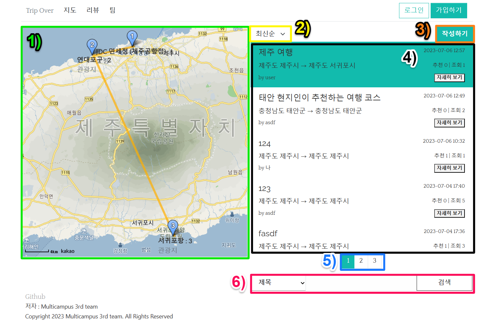

### 2-1. 지도 (2. 지도 페이지 그림 1번)
- 선택된 지도의 이미지를 보여준다.
- 마커를 클릭하여 인포 윈도우를 띄워 정보 모달창을 띄울 수 있다.
  - [장소 정보 모달창](#9-1-장소-정보-모달창)
  - [날씨 정보 모달창](#9-2-날씨-정보-모달창)

### 2-2. 조회 순서 드롭다운 (2. 지도 페이지 그림 2번)
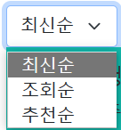
- 2.지도 페이지 그림 4번의 게시글 조회순서 기준을 선택한다.
  - 최신순 : 작성일 기준으로 조회한다.
  - 조회순 : 조회수를 기준으로 조회한다.
  - 추천순 : 추천수를 기준으로 조회한다.


### 2-3. 작성하기 버튼 (2. 지도 페이지 그림 3번)


- 로그아웃 상태인 경우 작성하기 버튼만 출력된다.
- '작성하기' 버튼을 클릭할 경우 [로그인 페이지](#5-로그인-페이지)로 이동하게 된다.


- 로그인 상태인 경우 추천한 게시글 버튼 또한 출력된다.
- '추천한 게시글' 버튼을 클릭할 경우 그 계정으로 추천한 계시글만 게시판에 조회된다.
- '작성하기' 버튼을 클릭할 경우 [맵 작성 페이지](#2-a-지도-작성-페이지)로 이동한다.

### 2-4. 게시판 (2. 지도 페이지 그림 4번)
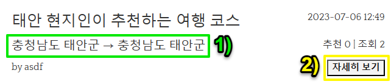
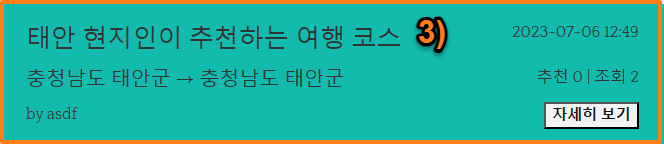

- 게시된 지도를 나열한다.
- 2-4 게시판 그림 1번은 이 지도의 출발지역과 도착지역을 나타낸다. (출발지역 → 도착지역)
- 2-4 게시판 그림 2번은 [지도 게시글 페이지](#2-b-지도-게시글-페이지)로 이동하는 버튼을 나타낸다.

### 2-5. 페이징바 (2. 지도 페이지 그림 5번)
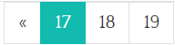
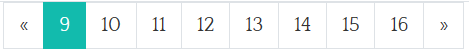
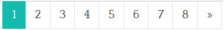

- 조회 상황에 위 그림과 같이 따라 페이징 바를 나타낸다.

### 2-6. 검색창 (2. 지도 페이지 그림 6번)
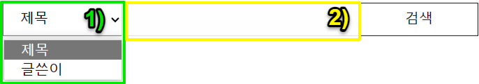
- 2-6. 검색창 그림 1번은 검색할 카테고리를 선택한다.
- 2-6. 검색창 그림 2번은 검색할 단어를 입력한다.
- 검색 버튼을 누르면 게시판에 조건에 해당하는 게시글을 조회한다.


## 2-a. 지도 작성 페이지

### 2-a-1. 경로 페이지
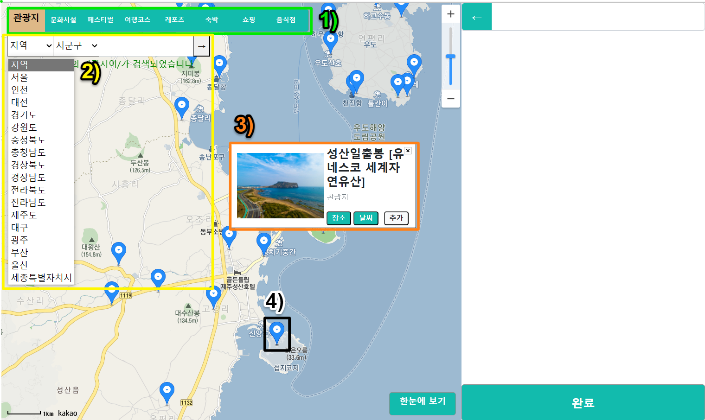
- 지도 내에서 마우스로 클릭한 좌표 근처에 마커가 표시된다.
- 위 그림의 1번의 버튼으로 검색할 카테고리를 선택할 수 있다.
- 위 그림의 2번 UI로 지역과 장소의 제목으로 검색할 수 있다.
- 위 그림의 3번은 마커를 클릭하면 나타나는 창이다.
  - '장소' 버튼 : [장소 정보 모달창](#9-1-장소-정보-모달창)을 띄운다.
  - '날씨' 버튼 : [날씨 정보 모달창](#9-2-날씨-정보-모달창)을 띄운다.
  - '추가' 버튼 : 지도에 장소를 추가한다.
- 위 그림의 4번은 검색된 장소를 나타내는 마커이다.

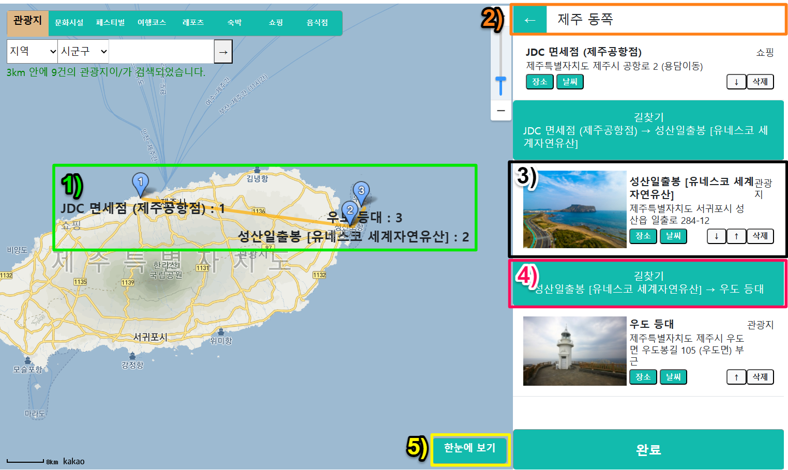
- 위 그림의 1번은 선택된 장소가 숫자로 쓰인 마커로 표현되는 것을 보여준다.
- 위 그림의 2번은 게시판으로 돌아가는 버튼과 제목 입력창을 나타낸다.
- 위 그림의 3번은 선택된 장소와 그 순서를 나타낸다.
  - '장소' 버튼 : [장소 정보 모달창](#9-1-장소-정보-모달창)을 띄운다.
  - '날씨' 버튼 : [날씨 정보 모달창](#9-2-날씨-정보-모달창)을 띄운다.
  - '↑' 버튼 : 이 장소의 순서를 위로 올린다.
  - '↓' 버튼 : 이 장소의 순서를 아래로 내린다.
  - '삭제' 버튼 : 선택된 장소를 해제한다.
- 위 그림의 4번은 장소와 장소 사이의 길찾기 페이지를 새 탭으로 띄운다.
  - 카카오 길찾기 맵이 사용되었다.

## 2-b. 지도 게시글 페이지
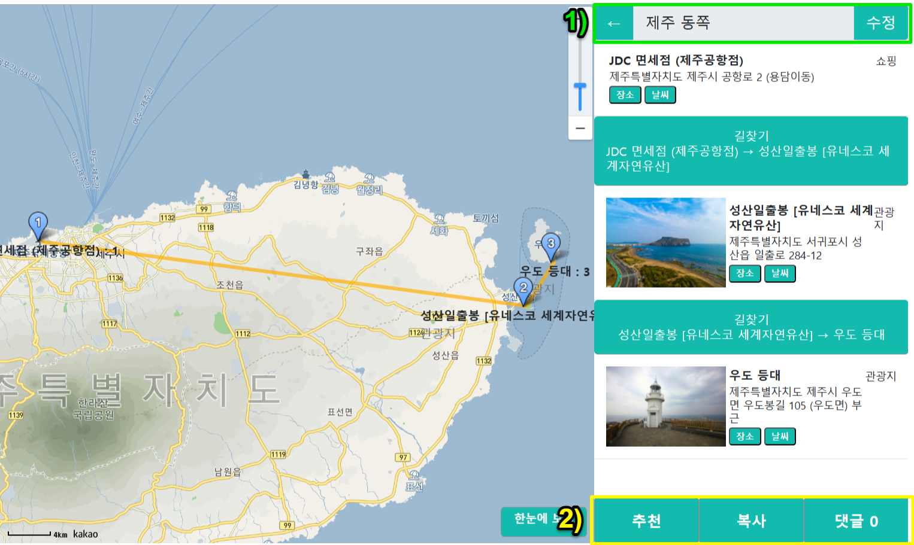

- 위 그림의 1번은 작성자에 따라 다르게 나타난다.
  - 작성자가 아니라면 다음과 같이 출력한다.
    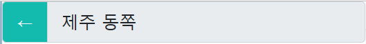
  - 로그인 된 계정이 작성자라면 수정 버튼이 추가된다.

    - '수정' 버튼 : 이 게시글을 [수정할 수 있는 페이지](#2-a-1-경로-페이지)로 넘어간다.


- 위 그림의 2번은 사용자가 로그인 되었는지에 따라 다르게 나타난다.
  - 로그아웃이면 다음과 같이 출력한다.

  - 로그인 하였으면 다음과 같이 '추천'과 '복사' 버튼이 또한 출력된다.
   
    - '추천' 버튼 : 추천이 되었다면 다음과 같이 출력된다.     
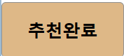   
    - '지도 복제' 버튼 : 이 지도와 똑같은 게시글을 이 계정으로 작성한다.
    - '댓글' 버튼 : 댓글을 작성한다. 자신이 작성한 댓글은 삭제할 수 있다.
  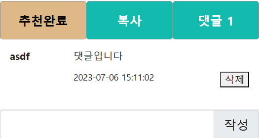


## 3. 리뷰 페이지


## 4. 팀 페이지
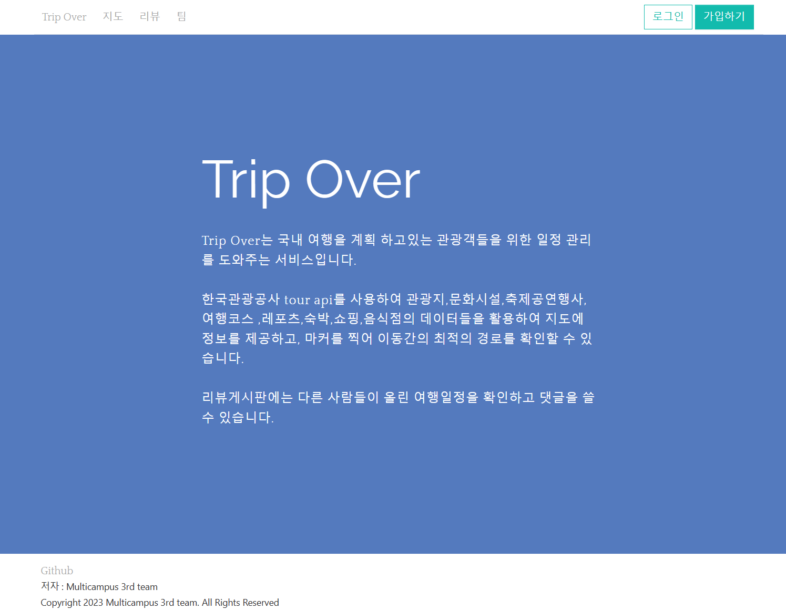
- 팀 및 프로젝트 서비스를 소개하는 페이지

## 5. 로그인 페이지
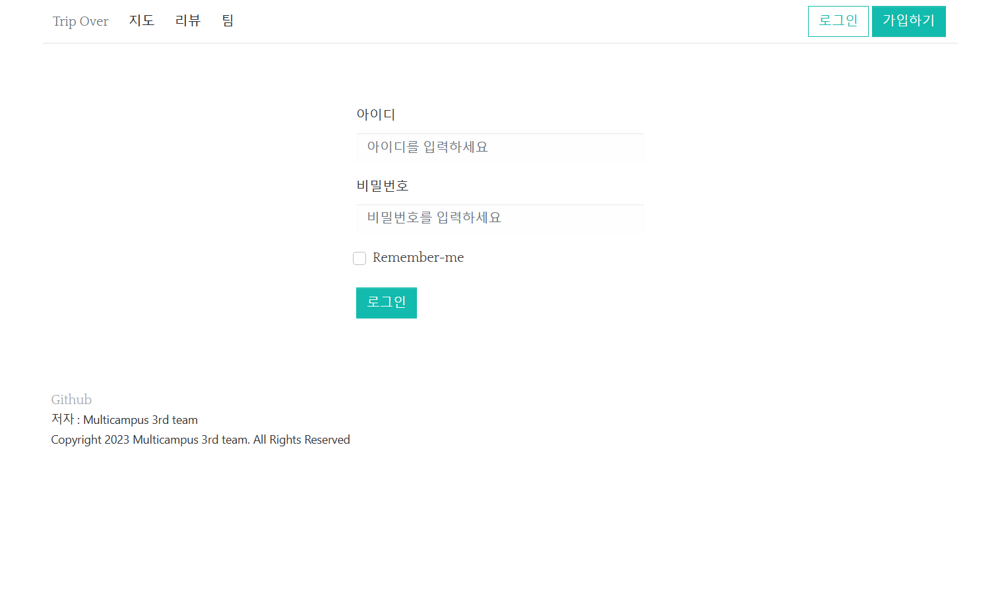
- 서비스를 이용하기 위해 로그인을 하는 페이지이다.
- 제출된 아이디와 비밀번호가 데이터베이스 내에 정보와 일지하지 않는다면 다음과 같은 검증 텍스트가 뜨게 된다.


## 6. 가입 페이지
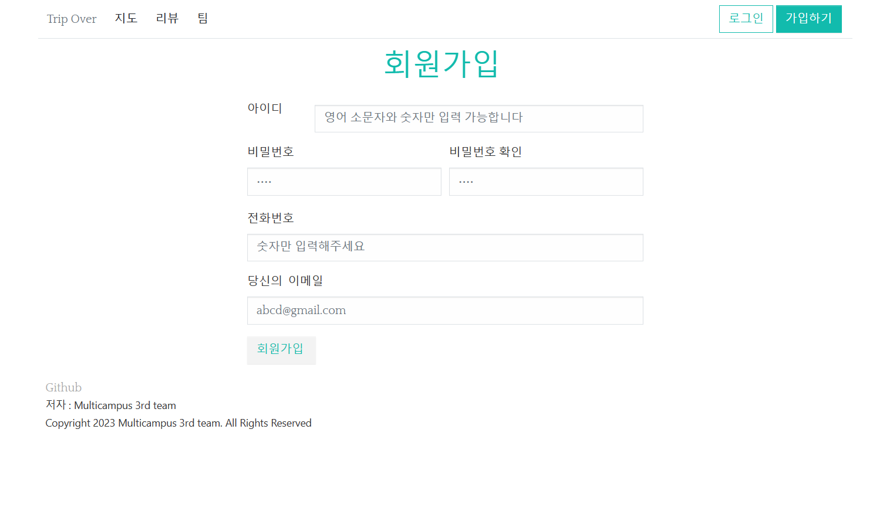
- 서비스를 이용하기 위한 계정을 만드는 페이지이다.
- 제출된 양식이 허용되지 않거나, 데이터베이스 내의 정보와 중복되는 경우 다음과 같이 검증 텍스트를 출력한다.
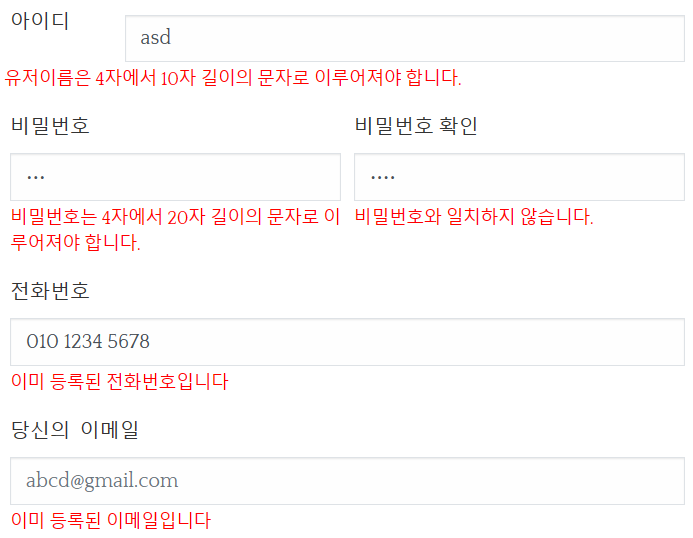

## 7. 마이 페이지
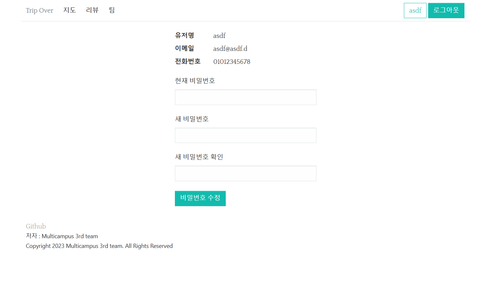
- 가입할 때 입력하였던 정보를 보여준다.
- 또한 현재 비밀번호와 새 비밀번호를 입력하여 비밀번호를 수정할 수 있다.

## 8. 관리자 페이지
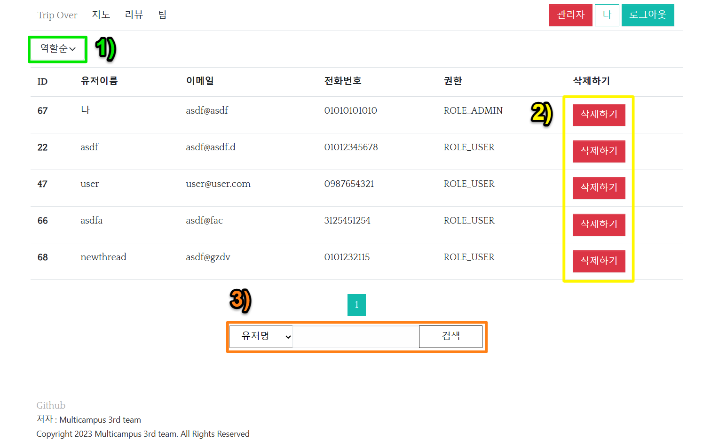
- 위 그림 1번은 조회 순서 기준을 나타낸다.  
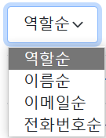

- 각 계정에 '삭제하기' 버튼(위 그림 2번)이 할당되어 있어 특정 계정을 삭제할 수 있다.
  - '삭제하기 버튼'을 누를 경우 아래와 같은 모달창을 띄워 정말 삭제할 것인지 확인한다.
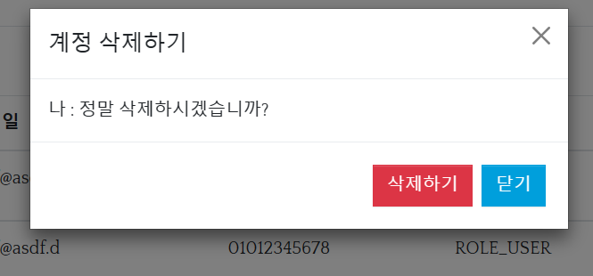

- 검색창에서 검색할 수 있다. (위 그림 3번)
  - 왼쪽 셀렉트 창을 통해 검색 기준을 바꿀 수 있다.  
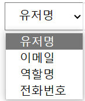

## 9. 정보 전달 모달창

### 9-1. 장소 정보 모달창
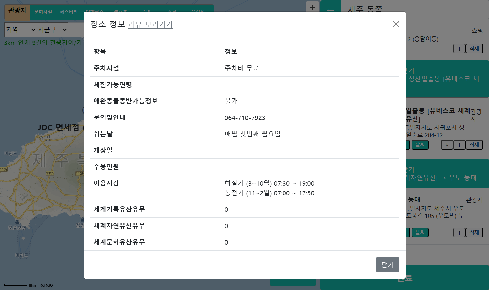
- 모달 제목 쪽에 있는 '리뷰 보러가기' 링크를 클릭하면 [리뷰 게시판](#3-리뷰-페이지)에 이 장소를 검색하여 새 탭에 띄운다.

### 9-2. 날씨 정보 모달창
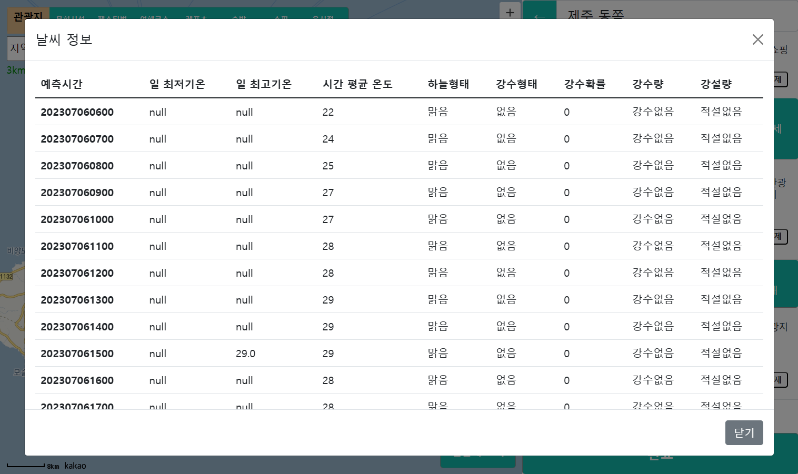


<br>

# 초기화

## 프로젝트에 없는 파일 (.gitignore에 등록된 파일)

<details>
<summary><b>접기/펼치기</b></summary>

- keys.properties
```properties
## api 키를 저장하는 파일

keys.kakao.map=	{카카오맵 javascript 키}

keys.tour.info.encode= {인코딩 된 tour api}
keys.tour.info.decode= {디코딩 된 tour api}
```

<br>

- errorMessages.properties
```properties
Size.registerForm.username=유저이름은 {2}자에서 {1}자 길이의 문자로 이루어져야 합니다.
Size.registerForm.password=비밀번호는 {2}자에서 {1}자 길이의 문자로 이루어져야 합니다.
Size.registerForm.passwordCheck=비밀번호 확인은 {2}자에서 {1}자 길이의 문자로 이루어져야 합니다.
Size.registerForm.email=이메일은 {2}자에서 {1}자 길이의 문자로 이루어져야 합니다.
Size.registerForm.phone=전화번호는 {2}자에서 {1}자 길이의 숫자로 이루어져야 합니다.

NotNull.username=유저이름을 입력해주세요
NotNull.password=비밀번호를 입력해주세요
NotNull.passwrodCheck=비밀번호 확인란을 입력해주세요
NotNull.email=이메일을 입력해주세요
NotNull.phone=전화번호를 입력해주세요

Pattern.username=유저이름은 영어 소문자와 숫자로만 이루어져야 합니다.
Pattern.password=비밀번호는 영어와 숫자 특수문자(!, @, #, $, %)로만 이루어져야 합니다.
Pattern.passwordCheck=비밀번호 확인은 영어와 숫자 특수문자(!, @, #, $, %)로만 이루어져야 합니다.
Pattern.phone=전화번호를 다시 확인해주세요.

Email.email=이메일 형식에 맞지 않습니다

Size.updatePasswordForm.currentPassword=현재 비밀번호는 {2}자에서 {1}자 길이의 문자로 이루어져야 합니다.
Size.updatePasswordForm.newPassword=새 비밀번호는 {2}자에서 {1}자 길이의 문자로 이루어져야 합니다.
Size.updatePasswordForm.newPasswordCheck=새 비밀번호 확인은 {2}자에서 {1}자 길이의 문자로 이루어져야 합니다.

Pattern.currentPassword=비밀번호는 영어와 숫자 특수문자(!, @, #, $, %)로만 이루어져야 합니다.
Pattern.newPassword=비밀번호는 영어와 숫자 특수문자(!, @, #, $, %)로만 이루어져야 합니다.
Pattern.newPasswordCheck=비밀번호 확인은 영어와 숫자 특수문자(!, @, #, $, %)로만 이루어져야 합니다.
```

<br>

- resources/application.properties
```properites
# Oracle Connection Settings
spring.datasource.driver-class-name=oracle.jdbc.driver.OracleDriver
spring.datasource.url=jdbc:oracle:thin:@localhost:1521:{SID} 
spring.datasource.username={유저이름}
spring.datasource.password={유저비밀번호}

# Mapper Location
mybatis.mapper-locations=classpath:/mapper/**/*.xml

# Domain Aliases
mybatis.type-aliases-package=com.plan.tour

# JDBC null settings
mybatis.configuration.jdbc-type-for-null=null


# JSP
spring.mvc.view.prefix=/WEB-INF/views/
spring.mvc.view.suffix=.jsp

# SQL 
spring.sql.init.mode=always


spring.messages.basename=messages/keys, messages/errorMessages
spring.messages.encoding=UTF-8
```

<br>

- schema.sql
```sql
CREATE TABLE testtable (
    test_id NUMBER(10) NOT NULL,
    test_name VARCHAR2(10) NOT NULL,
    test_date DATE NOT NULL
    );

CREATE TABLE AREA_LARGE (
    large_id NUMBER,
    large_code VARCHAR2(5) NOT NULL,
    large_name VARCHAR2(30) NOT NULL,
    CONSTRAINT area_large_pk PRIMARY KEY(large_id),
    CONSTRAINT area_large_uniq UNIQUE(large_code, large_name)
);

CREATE TABLE AREA_SMALL(
    small_id NUMBER,
    small_code VARCHAR2(5) NOT NULL,
    small_name VARCHAR2(30) NOT NULL,
    large_id_fk NUMBER NOT NULL,
    CONSTRAINT area_small_pk PRIMARY KEY (small_id),
    CONSTRAINT area_small_fk FOREIGN KEY (large_id_fk) REFERENCES AREA_LARGE (large_id) ON DELETE CASCADE
);


-- Sequence 생성 및 삭제
CREATE SEQUENCE large_id_seq
    START WITH 1
    INCREMENT BY 1
    MINVALUE 1
    NOCYCLE;


---- Sequence 생성 및 삭제
CREATE SEQUENCE small_id_seq
    START WITH 1
    INCREMENT BY 1
    MINVALUE 1
    NOCYCLE;


 본 페이지 관련!!!!--------------
-- user => 예약어 MemberUser 로 대체
create table MemberUser(
    user_id Number primary key,
    user_name VARCHAR2(50) not null,
    user_pwd VARCHAR2(60) not null,
    user_email varchar2(50) not null,
    user_phone varchar2(50) not null,
    user_role varchar2(50) not null,
    constraint uniq_MemberUser UNIQUE(user_name, user_email, user_phone)
);


-- Review
create table Review(
    review_id Number primary key,
    user_id Number not null,
    review_title varchar2(50) not null,
    review_content varchar2(1000) not null,
    create_date Date not null,
    update_date Date not null,
    review_views Number not null,
    review_recommends Number not null,
    contentid Number not null,
    filename varchar2(500),
    originFilename varchar2(500),
    filesize number(8),
    CONSTRAINT fk_userid FOREIGN key(user_id) REFERENCES MemberUser(user_id) ON DELETE CASCADE
 );
 

create table Review(
    review_id Number primary key,
    user_id Number not null,
    review_title varchar2(50) not null,
    review_content varchar2(1000) not null,
    create_date Date not null,
    update_date Date not null,
    review_views Number not null,
    review_recommends Number not null,
    contentid Number not null,
    CONSTRAINT fk_userid FOREIGN key(user_id) REFERENCES MemberUser(user_id) ON DELETE CASCADE
 );


create table place(
    contentId Number primary key,
    contentName varchar2(150)
);


-- Review_comment
create table Review_Comment(
    comment_id Number primary key,
    review_id Number not null,
    create_date Date not null,
    update_date Date not null,
    content varchar2(300) not null,
    comment_group Number not null,
    comment_depth Number not null,
    user_id int not null,
    constraint fk_review_id foreign key(review_id) references Review(review_id) on DELETE CASCADE,
    constraint fk_comment_user_id foreign key(user_id) references MemberUser(user_id) on DELETE CASCADE
 );


-- Path
 create table Path(
    path_id Number primary key,
    user_id Number not null,
    create_date Date not null,
    update_date Date not null,
    path_title Varchar2(50) not null,
    path_views Number not null,
    path_recommends Number not null,
    path_starting_area varchar2(30) not null,
    path_destination_area varchar2(30) not null,
    constraint fk_path_user_id foreign key(user_id) references MemberUser(user_id) on DELETE CASCADE
 );


---- mark
 create table Mark(
    mark_id Number primary key,
    path_id Number not null,
    mark_title Varchar2(50),
    mark_addr1 varchar2(200) not null,
    mark_addr2 varchar2(50),
    mark_contentId Number not null,
    mark_contentType varchar2(30) not null,
    mark_contentTypeId varchar2(30) not null,
    mark_firstImageURI varchar2(500),
    mark_firstImageURI2 varchar2(500),
    mark_posX Number not null,
    mark_posY Number not null,
    mark_tel Varchar2(15),
    mark_placeOrder Number not null,
    mark_area varchar2(30) not null,
    constraint fk_mark_path_id foreign key(path_id) references Path(path_id) on DELETE CASCADE
 );

---- path_comment
  create table path_comment(
     comment_id Number primary key,
     path_id Number not null,
     create_date Date not null,
     update_date Date not null,
     content Varchar2(500) not null,
     comment_group Number not null,
     comment_depth Number not null,
     user_id Number not null,
     constraint fk_PC_path_id foreign key(path_id) references Path(path_id) on DELETE CASCADE,
     constraint fk_PC_user_id foreign key(user_id) references MemberUser(user_id) on DELETE CASCADE
  );


-- favorite
create table Favorite(
    favorite_id Number primary key,
    user_id Number not null,
    path_id Number not null,
    constraint fk_favorite_user_id foreign key(user_id) references MemberUser(user_id) on DELETE CASCADE,
    constraint fk_favorite_path_id foreign key(path_id) references Path(path_id) on DELETE CASCADE
);


create table review_recommends(
    recommends Number primary key,
    review_id Number,
    user_id Number,
    CONSTRAINT fk_recommend_review_id FOREIGN key(review_id) REFERENCES review(review_id) ON DELETE CASCADE,
    CONSTRAINT fk_recommend_user_id FOREIGN key(user_id) REFERENCES MemberUser(user_id) ON DELETE CASCADE
);

 CREATE SEQUENCE recommend_id
    START WITH 1
    INCREMENT BY 1
    MINVALUE 1
    NOCYCLE;

CREATE SEQUENCE MemberUser_Sequence
    START WITH 1
    INCREMENT BY 1
    MINVALUE 1
    NOCYCLE;

CREATE SEQUENCE Review_Sequence
    START WITH 1
    INCREMENT BY 1
    MINVALUE 1
    NOCYCLE;

CREATE SEQUENCE Review_Comment_Sequence
    START WITH 1
    INCREMENT BY 1
    MINVALUE 1
    NOCYCLE;

CREATE SEQUENCE Path_Sequence
    START WITH 1
    INCREMENT BY 1
    MINVALUE 1
    NOCYCLE;

CREATE SEQUENCE Mark_Sequence
    START WITH 1
    INCREMENT BY 1
    MINVALUE 1
    NOCYCLE;

CREATE SEQUENCE Path_Comment_Sequence
    START WITH 1
    INCREMENT BY 1
    MINVALUE 1
    NOCYCLE;

CREATE SEQUENCE Favorite_Sequence
    START WITH 1
    INCREMENT BY 1
    MINVALUE 1
    NOCYCLE;

---- view 추가
create view comment_vi as
    select m.user_name,r.*
        from MemberUser m join Review_Comment r
            on m.user_id = r.user_id;

create view review_vi as
select m.*,p.contentName
    from(select m.user_name,r.*
            from MemberUser m join Review r
            on m.user_id = r.user_id) m join place p on m.CONTENTID = p.CONTENTID;
```

<br>

</details>